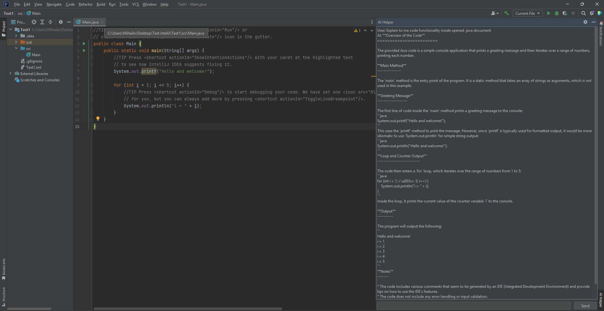
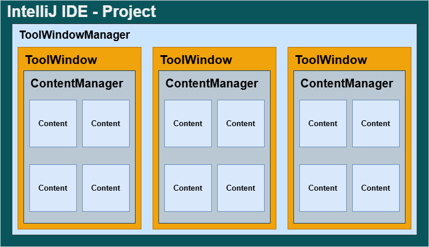

# 🤖 InteliJ-AI-Assistant

**AI Helper** is a context-aware AI assistant integrated directly into the **IntelliJ IDEA** environment. This project bridges the gap between source code editing and AI-powered assistance, providing a seamless, focus-oriented workflow for developers.

---

  
*Figure 1: The AI Helper user interface integrated into the IntelliJ sidebar.*

---

## 🚀 Key Features

* **Document Awareness**: The plugin automatically retrieves either specifically **selected code** or the **entire content** of the active document to provide contextually accurate answers.
* **Focus-Oriented**: Eliminates **context switching** by bringing AI capabilities directly into the IDE, removing the need for manual copy-pasting to a browser.
* **Asynchronous Processing**: All API communications are **non-blocking**, ensuring the IntelliJ UI remains responsive during network requests.

---

## 🏛 UI Architecture

To ensure deep integration with the JetBrains platform, the UI follows the standard **IntelliJ tool window hierarchy**:

  
*Figure 2: Component hierarchy: ToolWindowManager → ToolWindow → ContentManager → Content.*

* **ToolWindowManager**: Manages global positioning and visibility of all tool windows.
* **ToolWindow**: The functional pane located at the edges of the IDE.
* **ContentManager**: Handles the internal organization and tab system of the ToolWindow.
* **Content**: The presentation layer wrapping the custom Swing UI.

---

## 🛠 Technical Stack

* **IDE**: IntelliJ IDEA 2026.1.1.
* **JDK**: Eclipse Temurin-17.
* **Build System**: Gradle 8.9.
* **AI Engine**: Llama 3.3 (70B) integrated via the **Groq API**.
* **Interface**: Java Swing.

---

## 📂 Project Structure

The source code follows a **modular architecture** to maintain a clear separation of concerns:

* **`view/`**: Contains UI components like `ChatPanel` and `AIToolWindowFactory`.
* **`logic/`**: Houses core business logic, including `PromptBuilder` and `EditorContextManager`.
* **`service/`**: Manages external communications through the `AIService` class.
* **`resources/`**: Includes `plugin.xml`, the central manifest for registering components.

---

## 🔄 Data Flow

The plugin implements a **unidirectional data flow** for a responsive experience:

1.  **UI Initiation**: User enters a query into the `ChatPanel`.
2.  **Context Extraction**: `EditorContextManager` retrieves the relevant code context from the editor.
3.  **Prompt Construction**: `PromptBuilder` merges the question and code into a structured prompt.
4.  **Asynchronous Request**: `AIService` dispatches the request to the Groq API.
5.  **UI Update**: The AI response is parsed and displayed back in the chat history.

---

## 🔧 Installation & Setup

1.  **Clone the repository**.
2.  Ensure you have a valid **Groq API Key** configured (recommended via environment variables for security).
3.  Run the plugin in a **sandbox instance** using the Gradle task:
    ```bash
    ./gradlew runIde
    ```
    *This executes the plugin within an isolated IntelliJ instance to ensure safe testing.*

---

## 🔮 Future Improvements

* **Conversation History**: Persistent local storage to save chat logs across different IDE sessions.
* **Multi-file Context**: Expanding the context manager to analyze multiple open tabs or entire directories.
